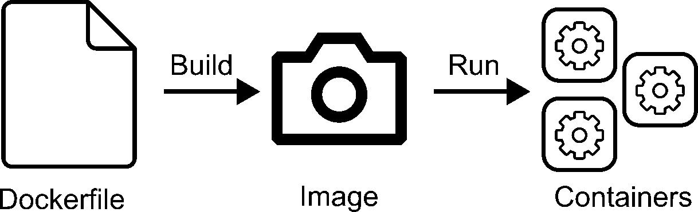
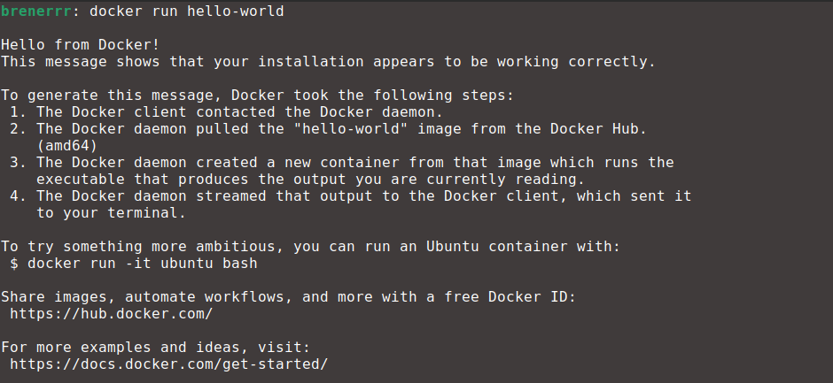

# First Things First

## What is Docker?

There is a great explanation of exactly what Docker is on their [official website](https://docs.docker.com/get-started/docker-overview/).

> Docker is an open platform for developing, shipping, and running applications. Docker enables you to separate your applications from your infrastructure so you can deliver software quickly. With Docker, you can manage your infrastructure in the same ways you manage your applications. By taking advantage of Docker's methodologies for shipping, testing, and deploying code, you can significantly reduce the delay between writing code and running it in production.

A more simplified explanation is that Docker is a tool used for delivering containers regardless of your operating system. Nice. But what are containers? You can think of them as lightweight virtual machines ([although they aren't](https://www.atlassian.com/microservices/cloud-computing/containers-vs-vms)) that you can get up and running super fast.

Dumbing it down even more: Docker is a way of spawning virtual machine-like environments (containers) in an easy, reliable, and fast way.

## What We Will Learn

This series of tutorials will show how to use Docker to create containers used for software development focused on scientific computing. For example, instead of installing OpenMPI, you can simply create a container that has OpenMPI installed and develop and test your code from there. The beauty of this approach is that you won't need to install OpenMPI or any dependency on our machine — you only need Docker.

The idea here is to run a container, which is launched using an image, which is assembled with a Dockerfile. Don't worry, we will get into more detail about each of these now.

### Containers
As hinted above, [containers](https://docs.docker.com/get-started/docker-concepts/the-basics/what-is-a-container/) are environments similar to virtual machines. They have four main characteristics:

- Self-contained. Each container has everything it needs to function with no reliance on any pre-installed dependencies on the host machine.
- Isolated. Since containers are run in isolation, they have minimal influence on the host and other containers.
- Independent. Each container is independently managed. Deleting one container won't affect any others.
- Portable. Containers can run anywhere! The container that runs on your development machine will work the same way anywhere else.

> [!NOTE]
> The term *host* will be used in this tutorial to refer to the machine from where containers are launched. In other words, it is your current operational system session.

### Images

But how to choose what packages will be inside a container? That's what docker [images](https://docs.docker.com/get-started/docker-concepts/the-basics/what-is-an-image/) are for. An image is a standardized package that includes all the files, binaries, libraries, and configurations needed to run a container. For this series, the idea is to create your own image with all the dependencies needed and then use it anywhere you want to have a development environment, independent of the host's specs.

So you will create or choose an existing image and launch a container from it. Instead of asking "How to choose what packages will be inside a container?" you should ask "How to choose what packages will be inside an image?" And that's what [Dockerfiles](https://docs.docker.com/reference/dockerfile/) are for.

### Dockerfile
A Dockerfile is a text document that contains all the commands a user would call on the command line to assemble an image. Think of it as a recipe. It is text file with a collection of steps that specifies which packages should be put in an image.

### Putting all together

The diagram below shows how these parts fit together.

The "build" step might take some time. During this step, all packages will be installed, so depending on what is in the Dockerfile, there might be a lot of compiling going on, which can take a while. However, the "run" step is almost immediate.

To see how this is useful, imagine you wanted to share your development environment with a friend. You can directly share the image you created, and they can instantly launch a container from it without having to install any dependencies on their machine.

## What we will NOT learn

It is equally important to state what you won't learn in this series. The objective is to use Docker to create a software development environment focused on scientific computing. In this way, the following topics will not be covered:

- Multi-container development: Different applications running in different containers and exchanging information between them.
- Cloud container deployment: Running applications in containers on the cloud.

## Installation

For completing the chapters in this series, install [Docker Desktop](https://docs.docker.com/desktop/?_gl=1*1fx30aa*_gcl_au*NzQ5MDE3MjM2LjE3Mzk4MDUyNjY.*_ga*MjExOTk0MDIyMi4xNzM4MTYxNDM4*_ga_XJWPQMJYHQ*MTc0MTk2MjY2MS4xMC4xLjE3NDE5NjI5NjAuNTkuMC4w). Although it is possible to perform basic operations using this GUI, we will focus on doing things in a terminal. **Remember to always have Docker Desktop running before using Docker-related commands.**

To confirm everything was installed successfully, open a terminal and execute `docker run hello-world`. You should get the same as the output below.

> [!IMPORTANT]
> If you are running Windows, execute all terminal commands on Powershell or WSL.

## Other
- In order to follow along, you need a basic knowledge of how to use a Linux terminal.
- I made this series with users on Linux and Windows in mind, but most of it should also apply to MacOS.

