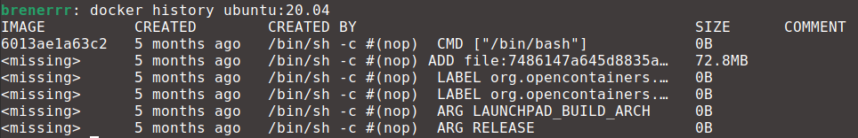
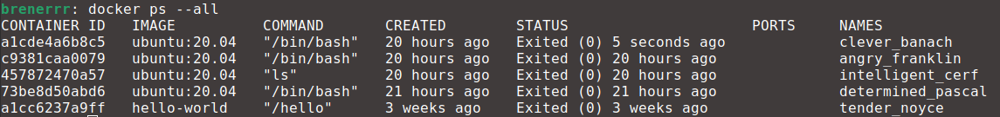
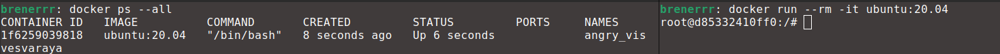

# Getting Started with Docker Containers

> [!WARNING]
> Make sure to open Docker Desktop in order to have a running docker engine.

## Finding a Base Image

Ubuntu is a popular OS for developing scientific computing related applications. It is then natural to use it as the container's OS. But how to find a Ubuntu Docker image? Just need search for "ubuntu" on https://hub.docker.com/ and select the first result.


> [!TIP]
> Docker Hub is a repository of Docker images. If you want to use a certain application, there is a high chance you will find an image of it there. For example, the developers of PyTorch have a [repository](https://hub.docker.com/r/pytorch/pytorch) with all its versions.


There are multiple Ubuntu images for different Ubuntu versions, which are identified by tags. All tutorials of this repository will use [version 20.04](https://hub.docker.com/layers/library/ubuntu/22.04/images/sha256-33d782143e3a76315de8570db1673fda6d5b17c854190b74e9e890d8e95c85cf), which is named *ubuntu:20.04*


## Running a Container

In order to launch a container based on this image, open a terminal and execute the command

```docker run ubuntu:20.04```

> [!TIP]
> A lot of flags for `docker run` will be shown in the following tutorials. Remember you can use `docker run --help` in case you forget what a flag does.

If you don't have this image already downloaded Docker will automatically do it for you. However you might be scratching your head thinking you did something wrong because nothing happened. Let's take a closer look at the instructions in the Dockerfile of this image with

```docker history ubuntu:20.04```

which outputs




There are a few commands in this Dockerfile but focus on `CMD ["/bin/bash"]`. It means that a container launched from this image will execute `bash`. After a container executes whatever is in the `CMD` command, it will automatically shut down and that is way it seemed nothing happend when you launched one earlier.


> [!NOTE]
> You can override whatever is in the `CMD` statement if you provide what the container should execute when launching it. For instance, try to run `docker run ubuntu:20.04 ls`. You will see the output of running `ls` in the root of the container.

In order to maintain the container that executes `bash` running, you need run it interactively. Technically this means the standard input (STDIN) should be kept open, which can be done with the flag `-i`.

```docker run -i ubuntu:20.04```

Now the container execution didn't stop and youc can to run commands in it, such as `ls`.

> [!TIP]
> You can disconnect from a container by pressing *CTRL* + *D* or by executing  `exit`.

But things aren't looking very "pretty". You can change that by allocating a pseudo-terminal to the container with the flag `-t`.

```docker run -it ubuntu:20.04```

Now we are talking. This terminal behaves exactly like a terminal on a minimal installation of Ubuntu 20.04.

## Reusing a Container

You used `docker run` a lot of times and each time you did that a new container was created. You can see all containers (running or not) with

```docker ps --all```

which in my machine outputs



You can see a few containers created from the *ubuntu:20.04* image and one from the *hello-world* one.

> [!IMPORTANT]
> Be aware that your containers most likely have a different names than mine. When `docker run` is executed without the `--name` flag Docker will automatically assign a random name to the container.

Although all containers listed aren't running, you can start one again and attach a terminal to it as if you were resuming some work. For example, I can do this with the container called *clever_banach* with

```
docker start clever_banach
docker attach clever_banach
```

> [!TIP]
> If you want to connect more terminals to a container, use the command `docker exec -it <CONTAINER-NAME> bash`.


## Cleaning Up

However you don't need those containers now. To delete them execute the command below changing the container names.

```docker rm clever_banach angry_franklin intelligent_cerf determined_pascal tender_noyce```


> [!IMPORTANT]
> If a container is running (their STATUS will be Up) you need to stop it before deletion. To do so execute `docker stop <CONTAINER-NAME>`.

Now if you run `docker ps --all` again there will be no containers listed. In the following chapters, `docker run` will be used quite often so from now on launch them using the flag `--rm` to avoid piling up a bunch of unused containers. This will automatically delete the container when it exits. Try

```docker run -it --rm ubuntu:20.04```

and in another terminal run `docker ps --all` again. You will see that there is only one container currently running (STATUS is Up).



Now disconnect from the container by executing `exit` or pressing *CTRL* + *D*. Run `docker ps --all` again and there are no containers listed.

> [!IMPORTANT]
> Be careful with the `--rm` flag. We are interested in using Docker to create a container for code development and testing that will be reused multiple times. In this way, use this flag only when you aren't interested in having a long lived container.


## You Learned How To
- Find a base image on Dockerhub.
- Check the contents of the Dockerfile that generated an image.
- Launch a container and keep it alive so we can check its contents and run commands in it.
- Restart and reattach a terminal to a previously created container.
- Delete containers.