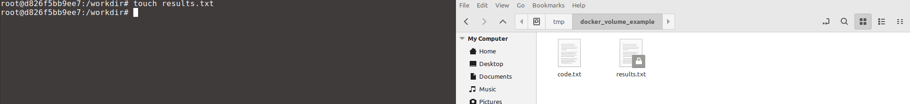

# Volumes


In the last section You Learned How To launch containers and interact with them. Now you will learn how to transfer files to/from them. This can be achieved with the flag `--volume`, although there are other ways to get the same result. The idea is to map a folder in the host to a folder in the container. So any files in this folder will be visible in both host and container.

> [!WARNING]
> Make sure to open Docker Desktop in order to have a running docker engine.


## Creating a Mount Point
First, create an empty directory somewhere of your choice (this will be our mount point in the host). Then create an empty file in this directory called *code.txt* (pretend this is a script that you want to use inside the container). Now open a terminal and navigate to this directory. If you are using on a Linux based OS this can be achieved with the commands bellow.

```
mkdir docker_volume_example
cd docker_volume_example
touch code.txt
```

## Launching a Container with a Mount Point
Now launch a container with

```docker run --rm -it --volume=${PWD}:/workdir  ubuntu:20.04```

> [!IMPORTANT]
> In order to use the command above you need to navigate to the mount point before launching the container. If you are using a terminal at a different location replace `${PWD}` with the full path to the mount point directory.

Navigate to `/workdir` and you can see that there is a file called `code.txt` there.

```
cd /workdir
ls
```

In case you create a file in `/workdir` it will also appear on the mount point in the host. For example, let's pretend you generated some results running something in the container with

```
touch results.txt
```

You can see that `results.txt` is also available in the host. When the container exits, everything that is in this directory will be preserved.



> [!IMPORTANT]
> If you check permissions on the host, you will see that your user has only *read* rights on files created inside the container. In order to give *read*, *write* and *execute* rights to everyone in the host you can run ```chmod -R 777 .``` inside the container at the mount point. Be aware that this has security risks since anyone with access to your computer now would be able to access the files in this directory.

## You Learned How To
- Create a mount point between host and container for seamlessly exchange of files.