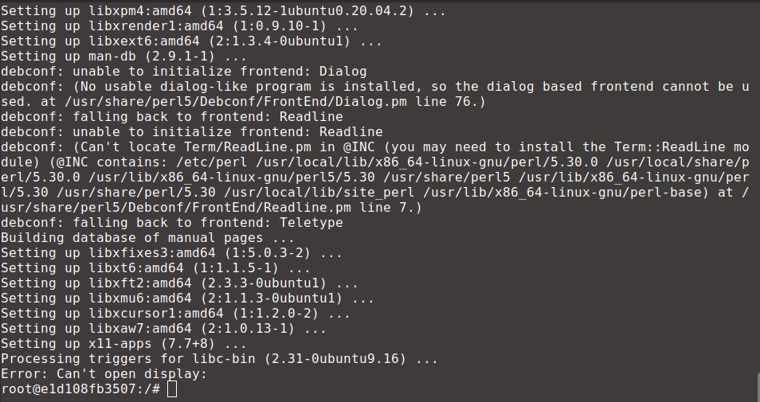
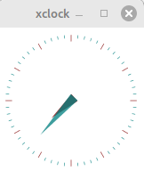

# Graphical Applications

In this chapter you will learn how to configure containers to handle graphical outputs. This is especially useful when using plotting libraries.

> [!WARNING]
> Make sure to open Docker Desktop in order to have a running docker engine.


## Trying to Launch XClock

Try to run `xclock` inside a container with what you learned so far.

```
docker run -it --rm ubuntu:20.04
```
and in the container execute

```
apt-get update && apt-get install x11-apps -y && xclock
```

> [!NOTE]
> Note that *sudo* wasn't used. This is because containers run as the root user by default (it is possible to change though).

Unfortunately an error is raised which states that the display couldn't be opened.



This happenned because the container doesn't have access to the graphical interface of your computer (you didn't give any permission for it to do so). You need to run a *X Server* to fix that.

## Running a X Server on Windows

If your OS is Windows, you need a X Window System server that lets users run Linux graphical applications on Windows. A good choice for that is [Xming](https://xming.softonic.com.br/). Make sure to install it and before running a container execute *Xming* (you can keep all default settings).


## Running a X Server on Linux
If your OS is Linux based, congratulations, you are almost good to go (you are already running an X server without knowing). You just need to allow connections coming from local docker containers. Execute the command below in a terminal to do so.

``` xhost +"local:docker@"```

## Trying to Launch XClock (Again)

At this point you have set up a X server on the host to accept connections from docker containers. Now you need to instruct the container how to do it. This is achieved by using the environment variable *DISPLAY* which is used to tell where to send the graphical output. If you are using Linux, you also need the flag `--network host` to allow the container to use the local network for the X traffic. If you are using Windows this flag isn't needed, but it doesn't cause any harm.

All of this is achieved by running the container with

```docker run -it --rm --network host --env DISPLAY=host.docker.internal:0.0 ubuntu:20.04```

if you are on Windows or

```docker run --rm -it --network host --env DISPLAY=$DISPLAY ubuntu:20.04```

if you are on Linux. Execute once again `apt-get update && apt-get install x11-apps -y && xclock` and a window with a clock should popup.




That's it. You can now install and use any software that has a graphical output seamlessly as if it was running in the host.

## What You Learned How To
- Configure a X Server.
- Launch a container capable of graphical output.