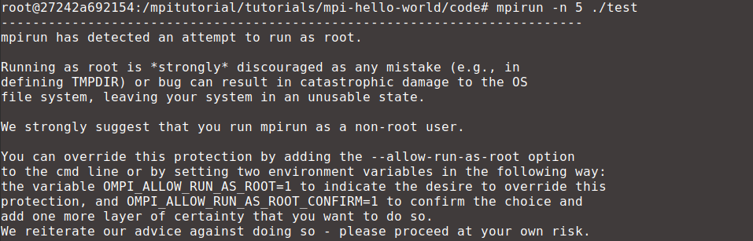
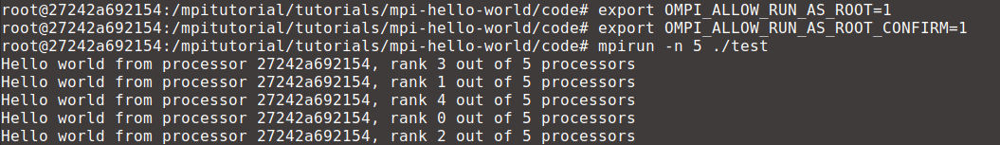

# MPI

In this chapter you will learn how to use MPI (Message Passing Interface), inside a container. Remember that the goal here is to use containers for development and not deployment. Therefore this tutorial will show how to use MPI inside a single container running on a single host.

> [!WARNING]
> Make sure to open Docker Desktop in order to have a running docker engine.


## Resource Constraints

The two most important constraints when dealing with parallel computing are memory and cpu usage. Therefore you might want to limit one or both when launching a container. In this tutorial you will see how to put a hard limit on the amount of memory and number of cpus a container can use. However more flexible constraints are possible (see [here](https://docs.docker.com/engine/containers/resource_constraints/#access-an-nvidia-gpu) for more information). By default when a container is launched without any constraints it is able to access all resources from the host.

### Memory

The flag `--memory` sets a hard limit on how much memory is available to a container. Its value should be followed by a suffix of b, k, m, g, to indicate bytes, kilobytes, megabytes, or gigabytes. For example, the command below would launch a container with only 6 megabytes of memory available.

```docker run -it --rm --memory=6m <CONTAINER-IMAGE>```

### CPU

The flag `--cpus` specify how much of the available CPU resources a container can use. For instance, the container launched with the command below is guaranteed at most one and a half of the CPUs.

```docker run -it --rm --cpus=1.5 <CONTAINER-IMAGE>```

## Installing MPI in the Container

You are launching containers from the image *ubuntu:20.04* which can be thought as a minimal Ubuntu 20.04 installation. It doesn't come with MPI pre-installed so you need to install it manually. To confirm this, launch a new container with

```docker run -it --rm ubuntu:20.04```

and then execute

```mpirun --version```

which will output the message "bash: mpirun: command not found".

The most common implementations of MPI are the Intel MPI Library and OpenMPI. The following instructions will show how to install the later. After a quick search you will find out that OpenMPI can be installed with a simple `apt-get install` command.

```apt-get update && DEBIAN_FRONTEND=noninteractive apt-get install openmpi-bin openmpi-common openssh-client openssh-server libopenmpi-dev -y```

> [!TIP]
> Sometimes when installing a package with `apt-get` the user will be asked to input some kind of information. This can be avoided with the environment variable `DEBIAN_FRONTEND=noninteractive`.

Now if you try to run `mpirun --version` again the output should read "mpirun (Open MPI) 4.0.3".

## Running a MPI Script

You can now use any software that makes use of OpenMPI inside this container. **Note that OpenMPI doesn't need to be installed in the host**. Try to run a simple *hello-world* script. First, install *git* to clone the code from a repository.

```apt-get update && apt-get install git```

Clone the repository from

```git clone https://github.com/mpitutorial/mpitutorial```

You can now compile the code.

```
cd mpitutorial/tutorials/mpi-hello-world/code
mpicc -o test mpi_hello_world.c
```

Finally you just need to run it.

```mpirun -n 5 ./test```

Well, almost.



Running MPI applications as root is not the best idea because certain bugs can cause your machine to explode or something.You have two options: create a user and run things logged in, or use the environment variables `OMPI_ALLOW_RUN_AS_ROOT` and `OMPI_ALLOW_RUN_AS_ROOT_CONFIRM` to bypass this warning. Remember you are running the application inside a container, which is an isolated environment. Therefore in the unlikely case of a catastrophic failure, you can just spawn a new container so the later option should be fine.

All you need to do is to set the aforementioned environment variables and try to execute the script again.


```
export OMPI_ALLOW_RUN_AS_ROOT=1
export OMPI_ALLOW_RUN_AS_ROOT_CONFIRM=1
mpirun -n 5 ./test
```


Now you have a environment fully capable of running OpenMPI applications.

## You Learned How To
- Constrain the amount of memory and number of CPUs a container has access to.
- Install and configure OpenMPI in a container.