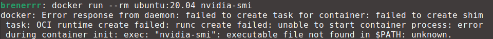
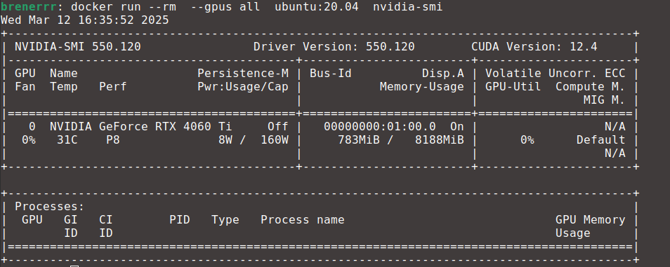
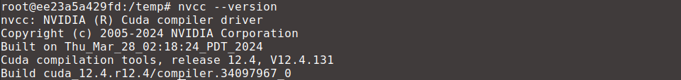

# CUDA

In this chapter, you will create containers capable of running CUDA GPU-accelerated applications, which are heavily used in the development of machine learning. You can skip this chapter if you don't need CUDA.

> [!WARNING]
> Make sure to open Docker Desktop in order to have a running docker engine.


## Host Machine Configuration
You need to install a few things on the host in order to a container to properly access its GPUs. Before proceeding make sure that your NVIDIA drivers are up to date.

### Windows
For a Windows host, Docker needs to be running with a WSL 2 backend. There is a great tutorial on how to do that [here](https://docs.docker.com/desktop/features/wsl/).

1. Open a terminal **with admin rights**.
2. Run ```wsl --install``` and restart your computer.
3. Open a terminal again and set the version 2 as the default one with  ``` wsl --set-version Ubuntu 2```.
4. Start Docker Desktop from the Windows Start menu.
5. Navigate to Settings.
6. From the General tab, select *Use WSL 2 based engine*
7. From the Resources > WSL Integration tab, activate "Ubuntu".
8. Select Apply & Restart

### Linux
For a Linux based OS, you need to install the NVIDIA Container Toolkit. A detailed tutorial can be found [here](https://docs.nvidia.com/datacenter/cloud-native/container-toolkit/latest/install-guide.html). To cut things short, just execute the commands below.

```
curl -fsSL https://nvidia.github.io/libnvidia-container/gpgkey | sudo gpg --dearmor -o /usr/share/keyrings/nvidia-container-toolkit-keyring.gpg \
  && curl -s -L https://nvidia.github.io/libnvidia-container/stable/deb/nvidia-container-toolkit.list | \
    sed 's#deb https://#deb [signed-by=/usr/share/keyrings/nvidia-container-toolkit-keyring.gpg] https://#g' | \
    sudo tee /etc/apt/sources.list.d/nvidia-container-toolkit.list


sudo apt-get update
sudo apt-get install -y nvidia-container-toolkit
```

## Acessing the GPU in the Container

When using a properly configured NVIDIA GPUs on a Linux distribution, the command `nvidia-smi` should return some information about them, such as model name, memory usage, etc. Try to run

```docker run --rm ubuntu:20.04 nvidia-smi```

to launch a container that will execute `nvidia-smi` instead of `bash` and exit afterwards. Since you didn't explicitly allowed the container to "see" any GPUs, this commands returns an error.



You need the flag `--gpus all` in order to grant the container access to all GPUs. So if you instead run

```docker run --rm --gpus all ubuntu:20.04 nvidia-smi```

you should see some GPU information.



## Installing the CUDA Toolkit

So far you can launch a container that can fully access all GPUs. However you still need to install CUDA. There are instructions on how to do that in [this tutorial](https://docs.nvidia.com/cuda/cuda-installation-guide-linux/). When considering an Ubuntu 20.04 installation, it consists of running the commands below.

```
apt-get update && apt-get install build-essential wget -y

wget https://developer.download.nvidia.com/compute/cuda/repos/ubuntu2004/x86_64/cuda-ubuntu2004.pin && \
mv cuda-ubuntu2004.pin /etc/apt/preferences.d/cuda-repository-pin-600 && \
wget https://developer.download.nvidia.com/compute/cuda/12.4.1/local_installers/cuda-repo-ubuntu2004-12-4-local_12.4.1-550.54.15-1_amd64.deb && \
dpkg -i cuda-repo-ubuntu2004-12-4-local_12.4.1-550.54.15-1_amd64.deb && \
cp /var/cuda-repo-ubuntu2004-12-4-local/cuda-*-keyring.gpg /usr/share/keyrings/ && \
apt-get update && \
DEBIAN_FRONTEND=noninteractive apt-get -y install cuda-toolkit-12-4 && \
rm cuda-repo-ubuntu2004-12-4-local_12.4.1-550.54.15-1_amd64.deb && \
echo "export PATH=/usr/local/cuda/bin:\$PATH" >> ~/.bashrc && \
source ~/.bashrc
```

This might take a while because the CUDA Toolkit is a bit heavy. After everything is finished execute

`nvcc --version`

and you should see the message below.



## You Learned How To
- Configure a Windows or Linux host to run containers using CUDA.
- Granted GPU access to a container.
- Installed the CUDA Toolkit in a container.