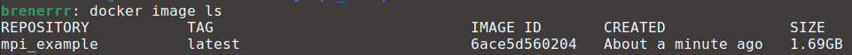

# Creating Your Own Image

> [!WARNING]
> Make sure to open Docker Desktop in order to have a running docker engine.


Imagine the following scenario:
1. You launch a container with `docker run -it --rm ubuntu:20.04`
2. You spend a lot of time installing everything you need, like MPI, CUDA and a bunch of other stuff.
3. You realise you forgot to use the `--volume` flag. Now you need to stop the container and relaunch it with `docker run -it --rm --volume=/some/path/in/host:/some/path/in/container ubuntu:20.04`.
4. You need to spend a lot of time again installing everything you need hoping you didn't forget something.

It is quite clear that this is not practical. By design containers should be something that you launch quickly and are ready to use. That is when [Dockerfiles](https://docs.docker.com/reference/dockerfile/) come to rescue.

## Creating a Dockerfile

As already explained in the first chapter, a Dockerfile is a set of instructions that are used to build an image.It will be mostly a collection of all commands you were running inside a container to make it ready to use.

For instance, in the MPI chapter you had to run all of the commands below to make the container MPI ready.

```
apt-get update && DEBIAN_FRONTEND=noninteractive apt-get install openmpi-bin openmpi-common openssh-client openssh-server libopenmpi-dev

export OMPI_ALLOW_RUN_AS_ROOT=1
export OMPI_ALLOW_RUN_AS_ROOT_CONFIRM=1
```

Instead you can create a file called `Dockerfile` with the following content

```
FROM ubuntu:20.04

RUN apt-get update && DEBIAN_FRONTEND=noninteractive apt-get install openmpi-bin openmpi-common openssh-client openssh-server libopenmpi-dev

ENV OMPI_ALLOW_RUN_AS_ROOT=1
ENV OMPI_ALLOW_RUN_AS_ROOT_CONFIRM=1
```

Breaking this down:
1. `FROM ubuntu:20.04` signals that *ubuntu:20.04* should be used as a base image.
2. `RUN apt-get update && DEBIAN_FRONTEND=noninteractive apt-get install openmpi-bin openmpi-common openssh-client openssh-server libopenmpi-dev` runs the `apt-get` commands that install a bunch of packages.
3. `ENV OMPI_ALLOW_RUN_AS_ROOT=1` and `ENV OMPI_ALLOW_RUN_AS_ROOT_CONFIRM=1` set the environment variables `OMPI_ALLOW_RUN_AS_ROOT` and `OMPI_ALLOW_RUN_AS_ROOT_CONFIRM`.

The structure of a Dockerfile should be an instruction followed by arguments. In this tutorial we will use only the instructions `FROM`, `RUN` and `ENV`.

Now open a terminal in the same directory where the Dockerfile was saved and execute

```
docker build -t mpi_example .
```

Congratulations! You just created your first custom docker image. If you execute `docker image ls` you will see that now there is an image called *mpi_example* listed.



## Launching a MPI Ready Container
Now instead of launching a container from the *ubuntu:20.04* image, you can do it from *mpi_example* and already have MPI working.

```docker run -it --rm mpi_example```

Then execute `mpirun --version` to confirm OpenMPI is already installed.


## Sharing Images

Assume you wrote some code that does something quite useful and wants to share that with your friends. You could ask them to install Docker and send them your code and Dockerfile. Then they could build an image, launch a container and run your code from it.

You can be even more and share the image *mpi_example* directly instead. There are two ways to do it.


### Docker Hub
You can use Docker Hub to store and distribute images for free (as long as they are public). There is an official tutorial about it [here](https://docs.docker.com/get-started/workshop/04_sharing_app/).

For example, I uploaded the image built in this tutorial to my Docker Hub repo. You can launch a container from it by running the command below (Docker will automatically download it).

```docker run -it --rm brenerrr/mpi_example:latest```

### Exporting an Image to a Tar File

Sometimes you can't distribute an image publicly. For those cases you can save them to a tar file and distribute those.

```docker save -o  mpi_example.tar mpi_example```

Now you can share this file to whoever you want. To load it execute

```docker load -i mpi_example.tar ```


## You Learned How To
- Translate commands we were running to a Dockerfile.
- Build an image from our own Dockerfile.
- Share a image with Docker Hub.
- Generate an image file and load it.