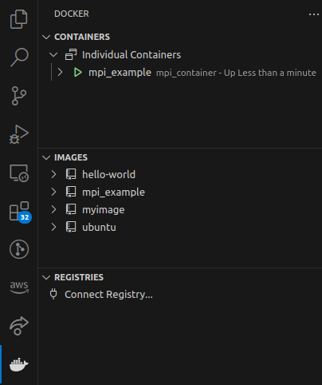
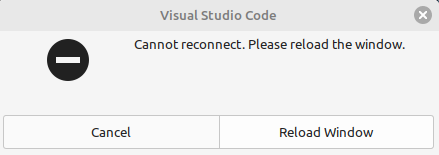
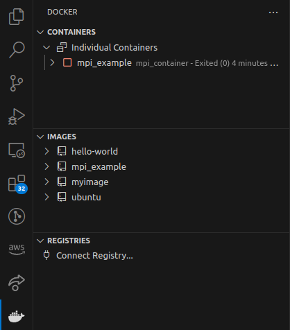

# Integration with VS Code

In this chapter you will learn how to setup a more software development friendly workflow. So far you know how create containers and attach terminals to them. This might be enough for you but sane people write code using an IDE, such as VS Code (no offense *vim* purists). If you recall the [Volume](../3.%20Volumes/Volumes.md) chapter, unless you use the `chmod` command, files created from the container can't be changed in the host. There is a much better alternative that is to use an IDE "inside" the container. More specifically, this tutorial will show how to do that with VS Code.

> [!WARNING]
> Make sure to open Docker Desktop in order to have a running docker engine.


## Necessary VS Code Extensions

I am assuming that you are minimally familiar with VS Code and it is already installed. Make sure to install the [Docker extension](https://code.visualstudio.com/docs/containers/overview) as well as the [Dev Containers](https://marketplace.visualstudio.com/items?itemName=ms-vscode-remote.remote-containers).

## Attaching VS Code to a Container

> [!NOTE]
> On the following example the flag `--rm` will be ommited when launching a container because it will be reused later. Also the flag `--name` will be used to name the container something meaningful.

Assume that the *mpi_example* image from the [Creating Your Own Image](../7.%20Creating%20Your%20Own%20Image/Creating%20Your%20Own%20Image.md) chapter already has all required dependencies. Navigate to a folder which will serve as a mount point between host and container and run

```docker run -it --volume ${PWD}:/workdir --name mpi_container mpi_example```

Now open a VS Code window and click on the Docker icon on the left side bar. Some information such as all available images and containers are displayed.



Right click on the running container and choose "Attach Visual Studio Code" (you need the Dev Containers extension for this option to be available). A new VS Code window running "inside" the container appeared. You can confirm that by clicking on File > Open Folder. The directories shown are not the directories from the host, but the ones from the container!

From here onwards you can proceed as usual when using VS Code. Since the mount point is the directory `/workdir`, I recommend opening this folder by clicking on *File > Open Folder > /workdir*. Another useful tip is that all terminals opened in this new window are attached to the container. To confirm this press `F1`, type "new terminal" and press *Enter*. It is exactly as if you were in a real machine running Ubuntu 20.04 with OpenMPI installed.

When you attach a new VS Code Window to a container it doesn't have any extensions installed by default. Just press *F1*, type "Remote: install local extensions" and press *Enter* and choose the ones you want.

## Resuming Work

Remember the terminal you used to run `docker run -it --volume ${PWD}:/workdir --name mpi_container mpi_example`? Close it. The following error should appear.



Just click on *Cancel* and close the VS Code Window that was opened inside the container. This happened because a container exits as soon as the terminal attached to it is closed and VS Code can only access a running container. This easy to see on the VS Code Window running in the host (the first one we opened).




To resume working inside the container you need to start it again with

```docker start mpi_container```

After that you can right click on *mpi_example* in the VS Code window and choose `Attach Visual Studio Code` again. The new window is exactly the way you left it.

## You Learned How To
- Attach a VS Code window to a container.
- Restart a container and reattach a VS Code window to it.